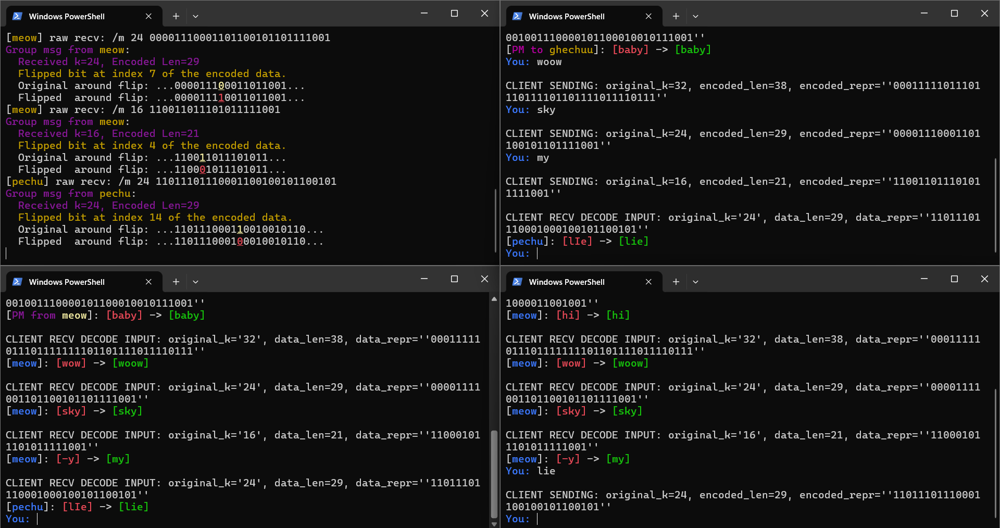

[](https://opensource.org/licenses/MIT)

# HammingNet-Chat: Multi-threaded Reliable Chat System

A Python-based chat application implementing a Client-Server architecture over TCP sockets. This project incorporates a custom Whole-Message Hamming Code layer to provide Forward Error Correction (FEC), ensuring message integrity even in high-noise network environments.

## Overview
While standard chat applications rely on TCP's built-in error detection at the transport layer, this project implements a layer of resilience at the application level. The server is designed to simulate network interference by intentionally flipping bits in the encoded bitstream. The client-side decoder identifies the syndrome, locates the error, and performs a bit-flip correction before displaying the message to the user.

## Technical Execution Flow

The project operates through a three-phase pipeline: Encoding, Simulated Transmission, and Decoding.

### 1. Encoding Phase (Sender Side)
When a user sends a message (e.g., "hi"), the following steps occur:
- **String to Binary:** The text is converted into a continuous 8-bit ASCII binary string. 
- **Redundancy Calculation:** The system calculates the number of parity bits ($r$) required for the data length ($k$) using the formula $2^r \ge k + r + 1$.
- **Bit Mapping:** A new bit array of length $n = k + r$ is created. Data bits are placed in all positions except those that are powers of two ($1, 2, 4, 8 \dots$).
- **Parity Computation:** Each parity bit at position $2^i$ is calculated by performing an XOR operation on a specific subset of data bits.

### 2. Transmission & Error Injection (Server Side)
To demonstrate the robustness of the Hamming code, the server acts as a "noisy channel":
- **Packet Interception:** The server receives the encoded bitstream.
- **Bit-Flipping:** The server intentionally selects one random index in the bitstream and inverts its value ($0 \to 1$ or $1 \to 0$).
- **Relay:** The corrupted packet is then forwarded to the intended recipient.

### 3. Decoding Phase (Receiver Side)
Upon receiving the corrupted bitstream, the client performs the following:
- **Syndrome Calculation:** The client re-calculates the parity bits. If the received parity bits do not match the calculated ones, a "Syndrome" is generated.
- **Error Localization:** The Syndrome value corresponds exactly to the 1-based index of the corrupted bit.
- **Bit Correction:** The client flips the bit at that specific index back to its original state.
- **Binary to String:** The parity bits are stripped away, and the corrected binary is converted back into ASCII text.

## Concrete Example: Transmitting the letter "B"

Here is a simplified walkthrough of a single-character transmission:

**1. Data Preparation:**
- Character: `B`
- ASCII Binary ($k=8$): `01000010`

**2. Encoding:**
- Required parity bits ($r$): 4 bits (Positions 1, 2, 4, 8)
- Total bits ($n$): 12 bits
- Encoded Bitstring: `P1 P2 D1 P4 D2 D3 D4 P8 D5 D6 D7 D8`
- Calculated result: `110110000010`

**3. Server-Side Corruption:**
- Server flips bit at **Index 7**.
- Received Bitstring: `110110100010` (Notice the 7th bit changed from `0` to `1`).

**4. Client-Side Correction:**
- Client calculates the Syndrome.
- Resulting Syndrome: `0111` (Binary for **7**).
- **Action:** Client flips the bit at Index 7 back to `0`.
- **Final Result:** `110110000010` -> Stripped to `01000010` -> ASCII `B`.

This process ensures that even though the server corrupted the data, the recipient sees the correct message `[B]` rather than an unreadable or incorrect character.

## Features
- **Real-time Forward Error Correction:** Repairs single-bit corrupted data using Hamming (n, k) logic.
- **Full-Duplex Messaging:** Utilizes the Python `threading` module for concurrent message handling.
- **Bit-Level Debugging:** Displays raw received bitstreams, original data length (k), and encoded length (n).
- **Syndrome Analysis:** Visualizes the exact index where an error was detected and corrected.
- **Protocol Support:** Includes broadcast (/m) and private messaging (/pm) capabilities.
- **Dynamic UI:** Rich terminal interface using colorama and termcolor to distinguish between system logs, outgoing, and incoming messages.

## Technical Demonstration



### Screenshot Analysis
1. **Decoder Logic:** The top-left terminal shows the server-side log where bits are flipped (e.g., Index 7). It displays the bit transition from 0 to 1.
2. **Real-time Correction:** In the client terminals, corrupted strings are corrected automatically. For example, the corrupted reception `[-y]` is successfully restored to its intended value `[my]`.
3. **Data Transparency:** The logs show the $k$ (data bits) and $n$ (total bits) values, allowing for the verification of the redundancy calculation.

## Technical Architecture

### 1. Hamming Code Implementation
The system calculates the necessary redundancy bits ($r$) for any input message length ($k$) based on the parity bit theorem:
`2^r >= k + r + 1`

- **Parity Insertion:** Redundancy bits are calculated and inserted at positions that are powers of two ($1, 2, 4, 8 \dots$).
- **Syndrome Calculation:** Upon reception, the client re-evaluates the parity bits. If the resulting syndrome is non-zero, the value represents the exact 1-based index of the error.

### 2. Messaging Protocol
Data is encapsulated in a custom string format to assist the decoder:
`[Sender]: /h <original_k_length> <encoded_bitstream>`

## Installation and Usage

### Prerequisites
The following Python libraries are required for the terminal UI:
```bash
pip install colorama termcolor
```

### Execution
1. **Start the Server:**
   ```bash
   python server1.py
   ```
2. **Start Clients (Run in separate terminal windows):**
   ```bash
   python client1.py
   ```

## Command Reference

| Command | Description |
| :--- | :--- |
| `/list` | Displays a list of all currently connected users. |
| `/m <message>` | Broadcasts an error-corrected message to all users. |
| `/pm <user> <message>` | Sends a private error-corrected message to a specific user. |
| `/quit` | Terminates the connection and closes the socket. |

## License

This project is distributed under the MIT License. See `LICENSE` for more information.

## Contact

Manolina Das - [GitHub Profile](https://github.com/manolina-13)
